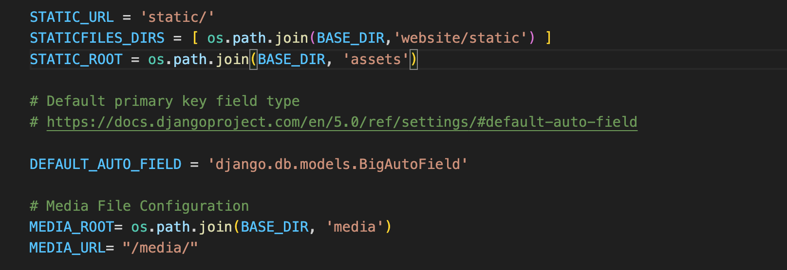

# JourneyJot
Python Django Based Application

## Basic Overview Of Project Scope
 

## Steps to setting up the project
* Create your virtual environment (to install django and other packages)
```
    python -m venv (path i.e journeyjot/venv) .
    python3 -m venv (path i.e journeyjot/venv) .
```

* Activate virtual environment
```
    source venv/bin/activate
```

* If you wish to Deactivate virtual environment
```
    deactivate
```

* Install django framework
```
    (venv) pip install django
```

* Use django-admin to create project and app
```
    (venv) django-admin startproject project .
    (venv) django-admin startapp website
```

Now what is the difference between a project and an app?

* The **project** is the brains of the entire application, containing configuration and the likes
* The **app** is a component part of the application where you can configure models, views and templates.
* In summary, you can have only **1** project but **multiple** apps which achieve various functionalities

## Some commands to remember
```
    python manage.py createsuperuser
    python manage.py makemigrations
    python manage.py migrate
    python manage.py runserver
```
```
    python3 manage.py createsuperuser
    python3 manage.py makemigrations
    python3 manage.py migrate
    python3 manage.py runserver
```

## Configuring some folders
* We need to configure some folders for use with our app (website). **NOTE** - media folder will be created automatically once you start uploading files. You can manually create the static folder under the app (i.e website > static)
```
    static - will hold the base template to be inherited by all other templates
    media - will house all the uploaded media files from the web app
```
* Setup **static** folder (projects > settings.py)
```text
    import os

    .....

    STATIC_URL = 'static/'
    STATICFILES_DIRS = [ os.path.join(BASE_DIR,'website/static') ] - replace 'website/static' with your app name
    STATIC_ROOT = os.path.join(BASE_DIR, 'assets')

```

* Setup **media** folder ( journey jot > media )
```text

    .......

    # Media File Configuration
    MEDIA_ROOT= os.path.join(BASE_DIR, 'media')
    MEDIA_URL= "/media/"
```



## Database Configuration 
* You can configure your DB Connection in project > settings.py
```
    .....

    DATABASES = {
        'default': {
            'ENGINE': 'django.db.backends.mysql',
            'NAME': 'DB_NAME',
            'USER': 'DB_USERNAME',
            'PASSWORD': 'DB_PASSWORD',
            'HOST': 'localhost',
            'PORT': '3306'
        }
    }

    .....

```